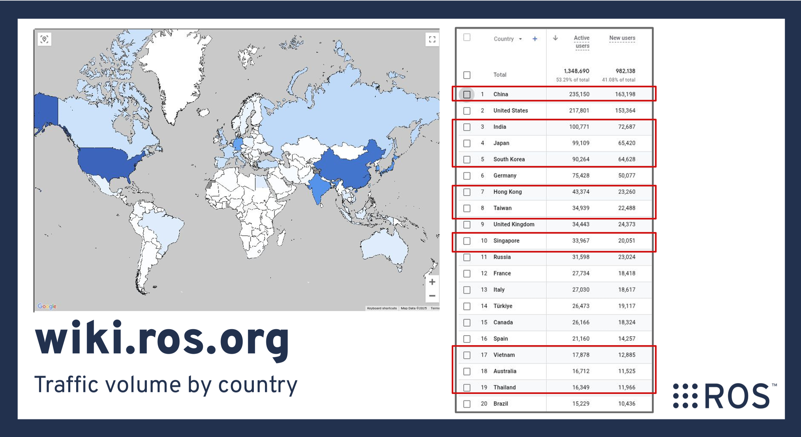

# ROS Asia Pacific Developer Meeting

## [Tomoya Fujita](https://github.com/fujitatomoya) 👋

- [ROS Project Management Committee](https://docs.ros.org/en/rolling/The-ROS2-Project/Governance.html#current-ros-pmc-constituents)
- ROS 2 core committer and developer
- OSS: Kubernetes(Edge), Container Network, and so on...

<!---
Comment here
--->

---

<!---
- We do love ROS / Robots / Robotics 🤖🦾🦿 I mean... who doesn't?
- Possibly thousands millions of active users 👥👥👥
- That means way much more use cases and requirements 📝
- There gotta be more issues / feature requests 🆕🛠️
--->

---

# ROS APAC Developer Meeting

- Contribute Issues/PRs to mainline 🤖
- Share and Solve the technical issues 👩‍💻
- Become ROS Committer and PMC 🚀

# Let's make a difference 💪
# Join now ✅

<!---
In temporary, github repository is under my private namespace.
But I would love to donate and move this repository if organization needs to be established.
--->

---

## 1st Meeting Information

- Nov 7th 2025 17:00-17:50 (GMT+9) 
- Please join and post the topics in the meeting note.
- Note: Meeting schedule needs to be considered after 1st one.
- **Invitation** 👉👉👉👉👉👉👉👉👉👉👉👉👉👉👉

<!---
Comment here
--->

---

# ROS (maybe should) stays unfinished...

Let’s promote ROS development in Asia 🥊
Let’s make the difference together 💪

# ROS Asia Pacific Developer Group 👉👉👉

<!---
Comment here
--->
