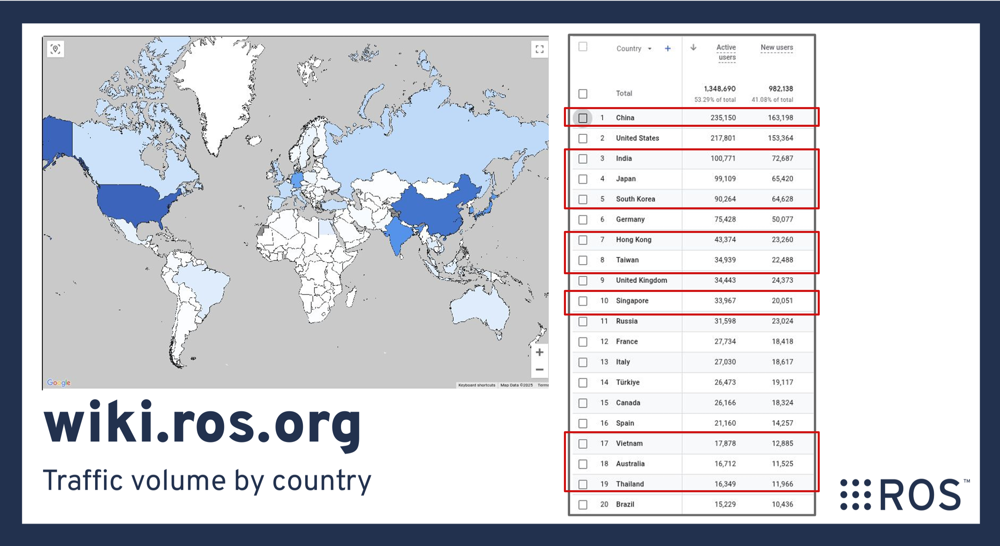

# ROS Asia Pacific Developer Meeting

## [Tomoya Fujita](https://github.com/fujitatomoya) 👋

- Former [ROS Technical Steering Committee](https://docs.ros.org/en/foxy/The-ROS2-Project/Governance/ROS2-TSC-Charter.html)
- [ROS Project Management Committee](https://docs.ros.org/en/rolling/The-ROS2-Project/Governance.html#current-ros-pmc-constituents)
- ROS 2 core committer and developer
- OSS: Kubernetes(Edge), Container Network, and so on...

<!---
Comment here
--->

---

# Motivation

Please take a look at [2024 ROS Metrics Report](https://cdck-file-uploads-us1.s3.dualstack.us-west-2.amazonaws.com/flex022/uploads/ros/original/3X/3/7/37c752346eb33f4f5ebde0c513b949b15adae453.pdf) (by [Katherine Scott](https://www.linkedin.com/in/katherineascott)), the statistics as objective facts.

<!---
Comment here
--->

---

<!---
Comment here
--->

---

# [ROS Project Management Committee](https://docs.ros.org/en/rolling/The-ROS2-Project/Governance.html#the-ros-project-management-committee-ros-pmc)

|   |   |   |
|---|---|---|
| [Christophe Bédard](https://github.com/christophebedard) | [Michael Carroll](https://github.com/mjcarroll) | [Alejandro Hernandez Cordero](https://github.com/ahcorde) |
| Tomoya Fujita | [Marco A. Gutiérrez](https://github.com/marcoag) | [Scott Logan](https://github.com/cottsay) |
| [Shane Loretz](https://github.com/sloretz) | [Audrow Nash](https://github.com/audrow) | [Michael Orlov](https://github.com/MichaelOrlov) |
| [Steven! Ragnarök](https://github.com/nuclearsandwich) | [Alberto Soragna](https://github.com/alsora) | [Yadunund Vijay](https://github.com/Yadunund) |
| [William Woodall](https://github.com/wjwwood) |  |  |

---

# In Brief...

- We do love ROS / Robots / Robotics 🤖🦾🦿 I mean... who doesn't?
- Possibly thousands millions of active users 👥👥👥
- That means way much more use cases and requirements 📝
- There gotta be more issues / feature requests 🆕🛠️

<!---
Comment here
--->

---

# ROS APAC Developer Meeting

- Contribute Issues/PRs to mainline 🤖
- Share and Solve the technical issues 👩‍💻
- Become ROS Committer and PMC 🚀

# Let's make a difference 💪
# Join now ✅

<!---
In temporary, github repository is under my private namespace.
But I would love to donate and move this repository if organization needs to be established.
--->

---

# What's in it for you and ROS?

- Technical Discussion / Sharing Experience
- Quality / Stability / Healthy OSS eco-system
- Promoting Industry-Academia and Community Technology Collaboration
- ROS mainline contribution including docs
- More developers and contributors

<!---
Comment here
--->

---

# Meeting Information

- Language: English (Don't worry English is my 2nd language too!)
- Target Repos: [ROS 2 Core Repositories](https://github.com/ros2/ros2)
- ROS Developers, Engineers, Students
- GoogleMeet／Bi-Weekly／50min
- GoogleGroup: https://groups.google.com/g/ros-apac-developer-meeting
- Github: https://github.com/fujitatomoya/ros-apac-developer-meeting
- GoogleDocs: https://docs.google.com/document/d/1IDQILCEVtEBZUHlttxzRNjhLG7i3sWfrk0Ik4ymPQO0/edit?tab=t.0

<!---
Currently google group and github repository is under my personal account.
This is expected to be a temporary repository, whenever it is ready, i would love to donate everything to the organization.
--->

---

# Example Topics

- Sharing issues created and highlighting specific challenges/problems
- Reviewing the status of Pull Requests, asking questions, and discussing solutions
- Discussing new feature proposals and technical challenges
- Exploring workarounds and mitigation strategies
- Presentation at ROSCon
- Improving the [ROS 2 Documentation](https://github.com/ros2/ros2_documentation)

**We only discuss on technical issues, problems and development**

<!---
Comment here
--->

---

## Manner / Policy

- Be constructive, productive and inclusive.
- Respect, nobody works for free.
- Trust needs to be earned.
- Progress, not perfection.
- Understanding != Agreement.

<!---
Comment here
--->

---

## 1st Meeting Information

- Nov 7th 2025 20:00-20:50 (GMT+9) 
- Please join and post the topics in the meeting note.
- Note: Meeting schedule needs to be considered after 1st one.
- **Invitation** 👉👉👉👉👉👉👉👉👉👉👉👉👉👉👉

<!---
Comment here
--->

---

# ROS Asia Pacific Developer 

Let’s promote ROS development in Asia 🥊🥊🥊

<!---
Comment here
--->
